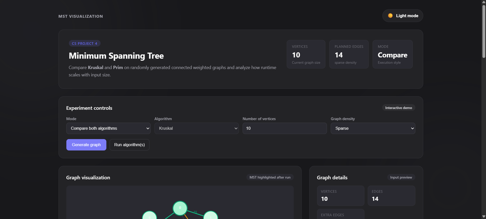
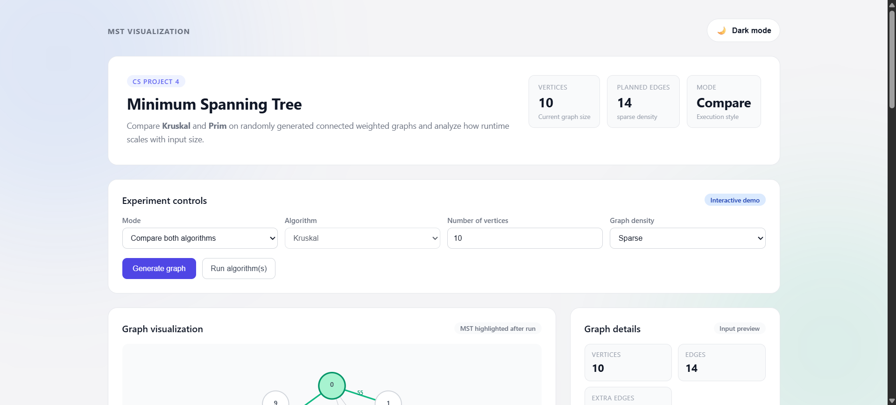
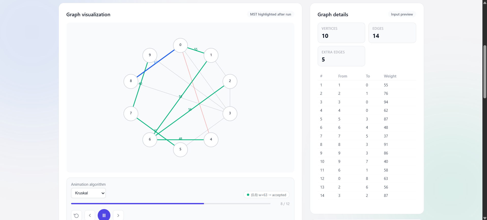
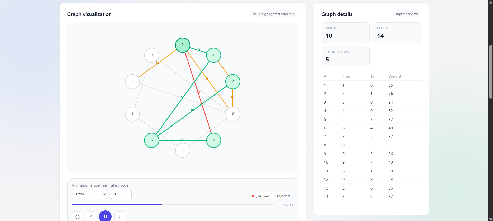
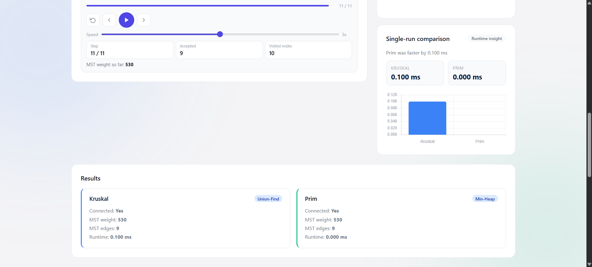
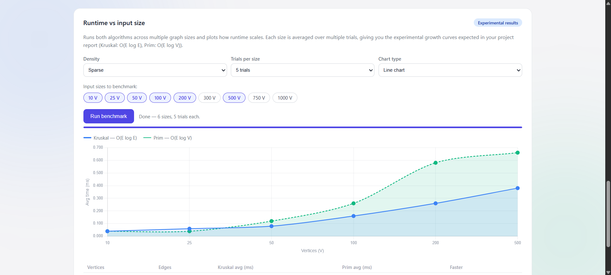
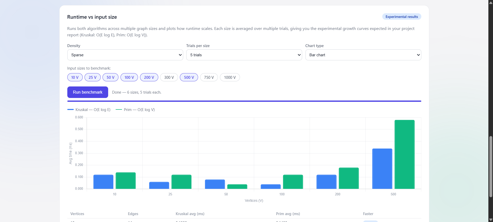
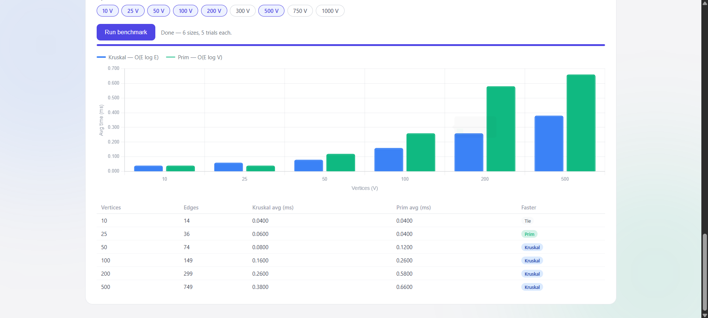

# MST Visualization — CS Project 4

Interactive visualization and benchmarking tool for **Kruskal's** and **Prim's** Minimum Spanning Tree algorithms.

## Features

- Generate random connected weighted graphs (sparse / medium / dense)
- Run Kruskal or Prim (or both) and compare results + runtime
- Step-by-step animation with transport controls (play, pause, prev, next, speed)
- **Runtime vs input size** benchmark — plots experimental growth curves across multiple vertex counts and densities
- Full data table with per-size Kruskal vs Prim averages

## Algorithms implemented from scratch

| File | Description |
|---|---|
| `src/algorithms/unionFind.js` | Union-Find with path compression + union-by-rank |
| `src/algorithms/minHeap.js` | Binary min-heap (priority queue) |
| `src/algorithms/kruskal.js` | Kruskal's MST — O(E log E) |
| `src/algorithms/prim.js` | Prim's MST — O(E log V) |
| `src/utils/graphGenerator.js` | Random connected graph generator + adjacency list builder |
| `src/utils/benchmark.js` | Timing utilities + async scaling benchmark |
| `src/utils/kruskalTrace.js` | Step-by-step Kruskal trace for animation |
| `src/utils/primTrace.js` | Step-by-step Prim trace for animation |

No external packages are used for any of the core algorithms.

## Getting started

```bash
npm install
npm run dev
```

Then open http://localhost:5173 in your browser.

## Build for production

```bash
npm run build
npm run preview
```

## Usage guide

1. **Set vertices + density** in the Experiment Controls panel.
2. Click **Generate graph** — the graph appears in the visualization panel.
3. Click **Run algorithm(s)** to compute the MST and see runtime results.
4. Use the **transport bar** to animate Kruskal or Prim step by step.
5. Scroll to **Runtime vs input size** — select sizes, trials, density, then click **Run benchmark** to generate the experimental growth chart for your report.

# DAA Project: Kruskal's and Prim's Algorithm

An interactive web application for visualizing and comparing **Kruskal's Algorithm** and **Prim's Algorithm** for finding the **Minimum Spanning Tree (MST)** of a connected weighted graph.

This project was created as part of a **Design and Analysis of Algorithms (DAA)** project to demonstrate how two classic MST algorithms work, how their results compare, and how their runtime changes with different graph sizes and densities.

---

## Features

- Generate random connected weighted graphs
- Choose graph density: Sparse, Medium, or Dense
- Run Kruskal's Algorithm
- Run Prim's Algorithm
- Compare both algorithms side by side
- Display MST edges and total MST weight
- Step-by-step animation of both algorithms
- Highlight accepted and rejected edges during animation
- Show visited nodes and frontier edges for Prim's Algorithm
- Runtime comparison using charts
- Benchmark performance across multiple input sizes
- Light mode and dark mode support

---

## Algorithms Implemented

### Kruskal's Algorithm

Kruskal's Algorithm sorts all edges by weight and selects the smallest edges one by one, as long as they do not form a cycle.

In this project, Kruskal's Algorithm uses the **Union-Find / Disjoint Set** data structure to efficiently detect cycles.

### Prim's Algorithm

Prim's Algorithm starts from a selected node and grows the MST by repeatedly choosing the minimum-weight edge that connects a visited node to an unvisited node.

In this project, Prim's Algorithm uses a **Min Heap** to efficiently select the next minimum-weight edge.

---

## Tech Stack

- React
- JavaScript
- CSS
- Chart.js
- Vite

---

## Project Structure

```text
src/
├── App.jsx
├── main.jsx
├── styles.css
├── algorithms/
│   ├── kruskal.js
│   ├── prim.js
│   ├── unionFind.js
│   └── minHeap.js
└── utils/
    ├── graphGenerator.js
    ├── benchmark.js
    ├── kruskalTrace.js
    └── primTrace.js

```
## Screenshots

### Main Interface (Dark Mode)



### Main Interface (Light Mode)



### Kruskal's Algorithm



### Prim's Algorithm



### Result Comparison



### Line Chart



### Bar Chart



### Runtime and Input Size



```